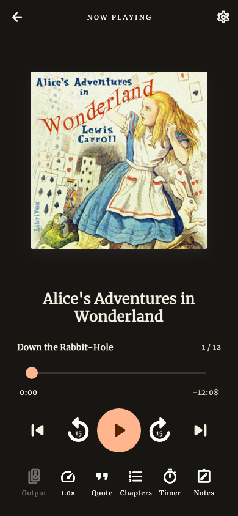
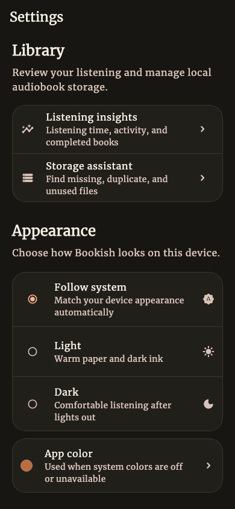

# Bookish

Bookish is a quiet, offline-first audiobook player for iOS and Android. It keeps
your books, playback history, notes, and preferences on your device and is built
for both single-file audiobooks and multi-file collections.

## Screenshots

<p align="center">
  
  
  
</p>

The screenshots feature the public-domain LibriVox recording of
[*Alice's Adventures in Wonderland*](https://librivox.org/alices-adventures-in-wonderland-by-lewis-carroll-5/)
by Lewis Carroll.

Regenerate the source images from deterministic Flutter fixtures with
`./tool/generate_readme_screenshots.sh`.

## What Bookish can do

### Import and organize

- Import MP3, M4A, M4B, AAC, FLAC, WAV, OGG, and Opus files with the native
  document picker, including files from iCloud and Android document providers.
- Copy imported audio into app-private storage so books remain available
  offline.
- Keep every selected numbered or multi-file item as a separate audiobook;
  imported files are never silently combined.
- Read embedded M4B `chpl`, QuickTime text-track, and supported audio-metadata
  chapters without loading complete media files into memory.
- Extract embedded cover art from MP3, MP4/M4B, FLAC, OGG, Opus, and WAV files.
- Browse the library as a grid or list, search it, and group books by author,
  series, folder, or listening status.
- Edit a book's title, author, series, folder, cover, track order, and chapters.
- Remove a book from the library while choosing whether to keep or delete its
  imported audio files.

### Listen

- Play in the background with lock-screen, notification, headset, CarPlay, and
  Android Auto controls.
- Choose the system audio output from the player.
- Seek by chapter or position, make configurable short and large jumps, and
  listen from 0.75x to 2x speed.
- On Android, optionally shorten silence and boost voices; on both platforms,
  continue automatically with the next book in a series.
- Remember playback speed per book and automatically rewind after longer pauses.
- Save progress frequently and on pause, seek, completion, lifecycle changes,
  and app shutdown.
- Use fixed or end-of-chapter sleep timers with a configurable fade-out and
  chapter fallback.
- Track listening time and review weekly, monthly, and yearly activity, total
  listening time, active days, and completed books.

### Capture and share

- Create timestamped text or voice notes, jump back to their position, edit
  them, and share individual notes.
- Browse notes across the whole library or by book, including notes retained
  from removed books.
- Export a book's notes as Markdown.
- In internal builds, transcribe a selected passage locally, adjust the
  captured range, edit the result, and share it as a quote.
- In internal builds, download and manage on-device speech models from
  Settings. Store builds exclude this capability and its native packages.

### Keep data under your control

- Export and restore JSON backups containing progress, notes, listening
  history, metadata, and settings.
- Inspect managed storage, missing books, duplicate entries, and orphaned files;
  clean reclaimable files or reset all app data.
- Choose system, light, or dark appearance and use the app in English or Slovak.

## Architecture

The shared source follows a feature-first structure under
`packages/bookish_player/lib/features/` with a
pragmatic MVI flow:

```text
Widget -> Cubit intent -> named use case -> repository port -> adapter
   ^                                                        |
   +---------------- immutable state -----------------------+
```

The current feature modules are:

- `library` — saved books, metadata, listening history, and Sembast persistence
- `importing` — file selection, durable copying, metadata probing, and chapter
  parsing
- `player` — playback, queueing, progress, listening sessions, sleep timers,
  and player UI
- `editing` — offline metadata, cover, track-order, and chapter editing
- `notes` — note capture, detail, gallery, sharing, archived notes, and Markdown
  export
- `insights` — listening-history aggregation and activity views
- `transcription` — local speech-model management and audio transcription
- `storage` — storage diagnostics, cleanup, and app-data reset
- `portability` — schema-versioned whole-app JSON backup and restore
- `settings` — persisted appearance, playback, and library preferences
- `core` — navigation, dependency injection, database setup, localization,
  theming, and shared presentation code

Every route has a `ScreenRoot` composition boundary. Roots resolve Cubits through
GetIt/Injectable; ordinary widgets bind immutable state and dispatch user intent.
Named use cases coordinate multi-step work, repository ports isolate platform
adapters, and data-only state uses Freezed. Named `go_router` routes include
deep-linkable player IDs.

The complete boundaries and enforced size limits are documented in
[`docs/architecture.md`](docs/architecture.md).

## Distribution targets

The repository keeps both distributions on one branch with independent Flutter
dependency graphs:

- `apps/store` is the Google Play and Apple App Store target. It has no
  dependency on Cactus or the transcription FFmpeg adapter.
- `apps/internal` enables transcription and depends on
  `packages/bookish_cactus_transcription`. The app owns the GetIt registration
  and maps the package's standalone DTOs to Bookish domain models.
- `packages/bookish_player` contains the shared application, feature, and test
  code.

The optional Cactus package has no dependency on Bookish, GetIt, or Injectable;
it can be constructed and used as an ordinary library.

The Android and iOS projects were copied from the original application rather
than regenerated, preserving the existing native configuration.

## Development

Bookish requires the Flutter SDK and a configured iOS or Android toolchain.

```sh
cd packages/bookish_player
flutter pub get
flutter pub run intl_utils:generate
dart run build_runner build
dart format lib test
flutter analyze
flutter test

cd ../../apps/store
flutter run

cd ../internal
flutter run
```

Build store artifacts only through the guarded scripts:

```sh
./tool/build_store.sh android
./tool/build_store.sh ios
```

Both app targets share the same release identity. Apple team and bundle values
live in `signing/ios/Signing.xcconfig`. For Android release signing, copy
`signing/android/key.properties.example` to
`signing/android/key.properties` and place the referenced private keystore in
that directory. The credential file and keystore remain untracked.

Each script uses the committed store lockfile and fails before building if
Cactus or `ffmpeg_kit_flutter_new_audio` enters the store dependency graph.
`./tool/verify_store_dependencies.sh` runs that guard without producing a store
artifact.

For a local coverage report, run `flutter test --coverage` followed by
`dart run tool/coverage_report.dart`. Add `--enforce` to check the documented
targets locally. This repository intentionally contains no CI/CD workflow.

Do not edit generated `*.freezed.dart`, `*.g.dart`, or `injection.config.dart`
files by hand.

Localization source files live in `packages/bookish_player/lib/l10n`. After changing an ARB file, run
`flutter pub run intl_utils:generate` to refresh the generated `S` class. The app
follows the device locale and currently supports English and Slovak.

## Test media

An M4B sample from the freely available LibriVox collection below is kept in
`packages/bookish_player/test_samples/` for local parser and playback testing:

- <https://archive.org/details/LibrivoxM4bCollectionAudiobooks_22>
